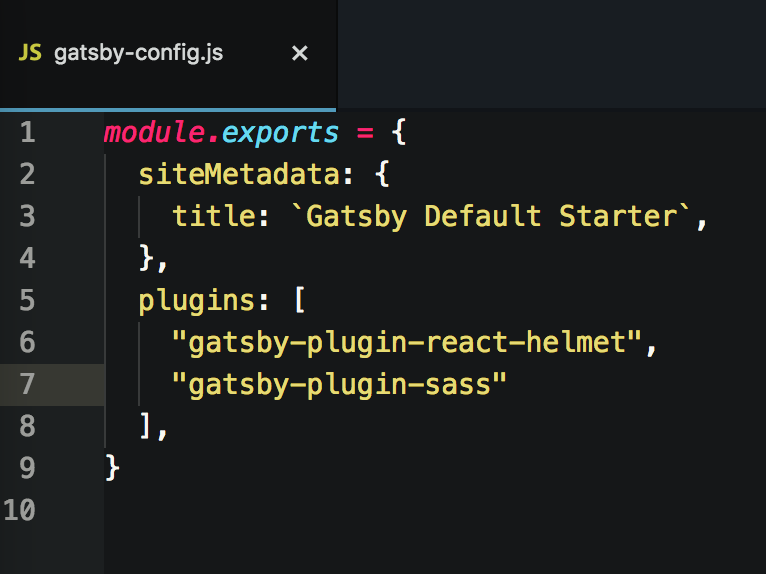

# Working with Sass in Gatsby Project

Requirements:
- Node: [https://nodejs.org/](https://nodejs.org/ "Node")
- npm: [https://www.npmjs.com/](https://npmjs.com/ "npm")
- GatsbyJs: [https://www.gatsbyjs.org/](https://www.gatsbyjs.org/ "GatsbyJs")
- gatsby-plugin-sass: [https://www.npmjs.com/package/gatsby-plugin-sass](https://www.npmjs.com/package/gatsby-plugin-sass)

## Getting started with Gatsby Setup

- go to [GatsbyJs][] website:
```
open https://www.gatsbyjs.org
```

- click [Get Started][] button and follow along

- Terminal: Install Gatsby's command line tool
```
npm install --global gatsby-cli
```

- create a new Gatsby site
```
gatsby new gatsby-site
```
- Go to new folder
```
cd gatsby-site
```

## Installing dependencies

- Install [gatsby-plugin-sass][] . Here is a list of [official plugins][].
```
npm install --save gatsby-plugin-sass
```
*more details at* [Gatsby plugins][] or [gatsby-plugin-sass][]

- Open project in [Atom][] editor or [alternative][] editors
```
atom .
```

- Include "gatsby-plugin-sass" in your gatsby-config.js file




[Node]: https://nodejs.org/
[npm]: https://www.npmjs.com/
[GatsbyJs]: https://www.gatsbyjs.org/
[Get Started]: https://www.gatsbyjs.org/docs/
[gatsby-plugin-sass]: https://www.gatsbyjs.org/packages/gatsby-plugin-sass/
[Gatsby plugins]: https://www.gatsbyjs.org/docs/plugins/
[official plugins]: https://www.gatsbyjs.org/docs/plugins/#official-plugins
[Atom]: https://atom.io/
[alternative]: https://alternativeto.net/software/atom/
